# 🏥 Iganga School of Nursing and Midwifery (ISNM) Management System

A comprehensive digital management system for Iganga School of Nursing and Midwifery, featuring a professional website, role-based management dashboards, student portal, and complete administrative functionality.

## 🎯 Project Overview

The ISNM system is a complete school management solution designed specifically for healthcare education institutions. It includes:

- **Professional School Website** with all required pages
- **Role-Based Management System** with 20+ different user roles
- **Student Portal** with academic records, finances, and communication
- **Comprehensive Financial Management** with bursar dashboard
- **Application Processing System** with file uploads
- **Communication System** for messaging between all stakeholders

## 🛠️ Technologies Used

1. **PHP 8.1** - Backend development
2. **MySQL (MariaDB)** - Database management
3. **Bootstrap 5** - Responsive UI framework
4. **JavaScript & jQuery** - Interactive functionality
5. **HTML5 & CSS3** - Modern web standards
6. **Font Awesome 6** - Icon library

## ✨ Key Features

### 🌐 School Website
- **Homepage** with school information and statistics
- **About Page** with vision, mission, and governance
- **Programs Page** with detailed academic offerings
- **Application Form** with comprehensive fields and file uploads
- **Contact Page** with map integration
- **Donation & Volunteer** pages for community engagement
- **Organizational Structure** with role-based login access

### 👥 Role-Based Management System
- **Executive Leadership**: Director General, CEO
- **Directors**: Academics, ICT, Finance
- **School Management**: Principal, Deputy Principal, Bursar
- **Administrative Staff**: Registrar, HR Manager, Secretary, Librarian
- **Academic Staff**: Department Heads, Lecturers, Sickbay
- **Support Staff**: Matrons, Drivers, Security
- **Student Leadership**: Guild President, Class Representatives
- **Students**: Complete student portal access

### 🎓 Student Portal Features
- **Academic Records**: Results, transcripts, GPA tracking
- **Financial Information**: Fee statements, payment history
- **Document Downloads**: Academic documents, certificates
- **Communication System**: Messaging with staff and peers
- **Profile Management**: Personal information and photo uploads
- **Course Information**: Current courses and schedules

### 💰 Comprehensive Financial Management
- **Student Billing**: Automated fee assignment and invoicing
- **Payment Processing**: Multiple payment methods (Mobile Money, Bank, Cash)
- **Budget Management**: Departmental budget allocation and tracking
- **Expenditure Tracking**: Expense approval and monitoring
- **Financial Reports**: Daily, weekly, monthly, and annual reports
- **Debtors Management**: Outstanding fee tracking and reminders

### 📊 Academic Management
- **Curriculum Development**: Course design and approval
- **Examination System**: Scheduling, results, and analysis
- **Performance Tracking**: Student academic progress monitoring
- **Faculty Management**: Lecturer assignments and performance reviews
- **Quality Assurance**: Accreditation compliance and standards

### 📱 Communication System
- **Internal Messaging**: Between students, staff, and management
- **Announcements**: School-wide and targeted communications
- **Priority Messaging**: Urgent and high-priority communications
- **Message Tracking**: Read receipts and response management

## 🦤 SCREENSHOTS

### Pre-View
<div style="display: flex;flex-direction: column; grid-gap: 10px;">
     <div style="display: flex; grid-gap: 10px;">
        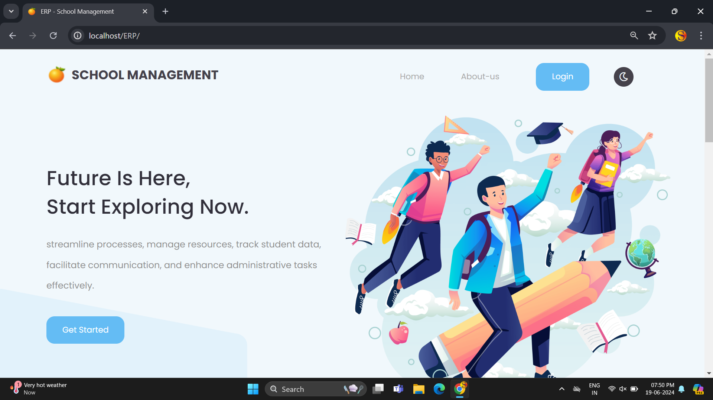
        
    </div>
</div>
<br>

### Admin View
<div style="display: flex;flex-direction: column; grid-gap: 10px;">
   <div style="display: flex; grid-gap: 10px;">
        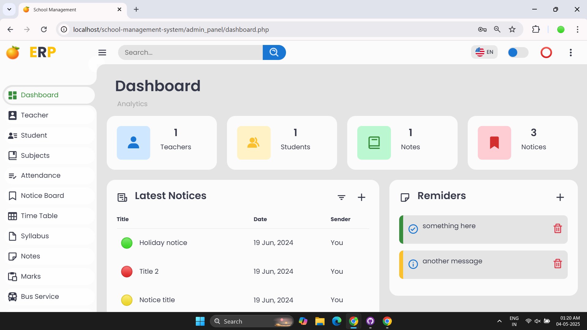
        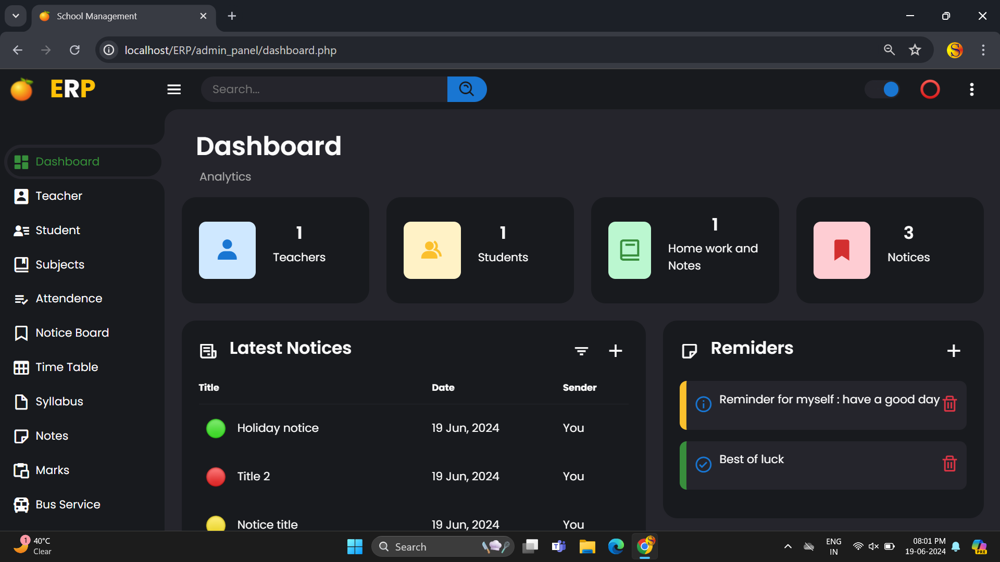
    </div>
     <div style="display: flex; grid-gap: 10px;">
        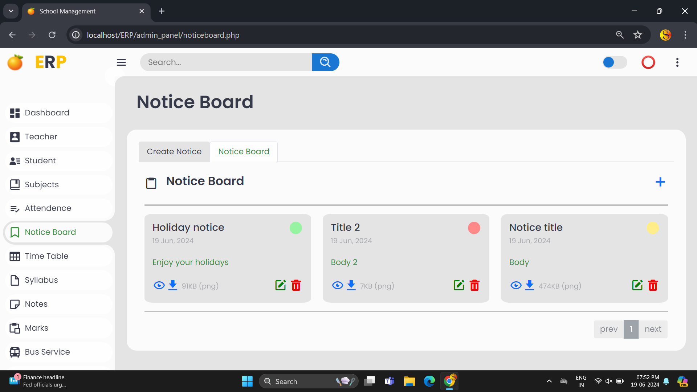
        
    </div>
     <div style="display: flex; grid-gap: 10px;">
        
        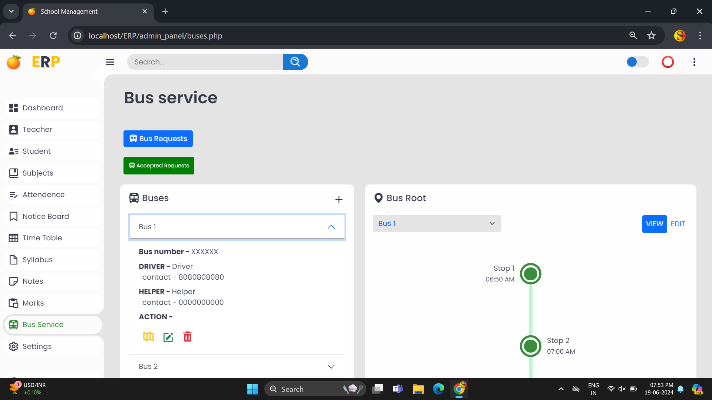
    </div>
     <div style="display: flex; grid-gap: 10px;">
        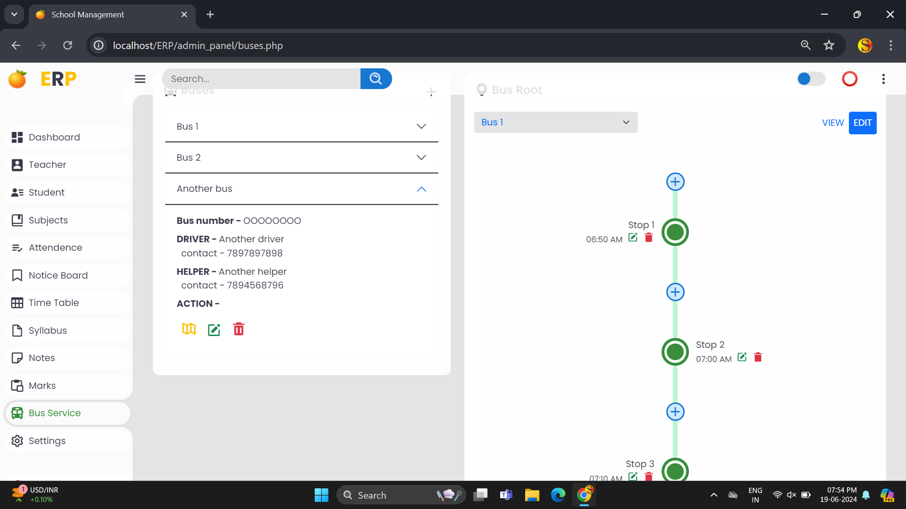
        
    </div>
</div>
<br>

### Teacher View
<div style="display: flex;flex-direction: column; grid-gap: 10px;">
    <div style="display: flex; grid-gap: 10px;">
        
        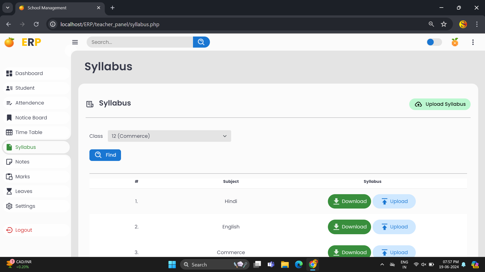
    </div>
</div>
<br>

### Student View
<div style="display: flex;flex-direction: column; grid-gap: 10px;">
   <div style="display: flex; grid-gap: 10px;">
        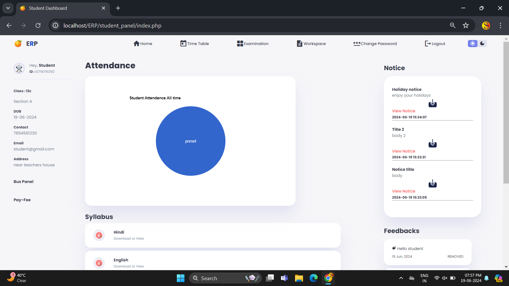
        
    </div>
    <div style="display: flex; grid-gap: 10px;">
        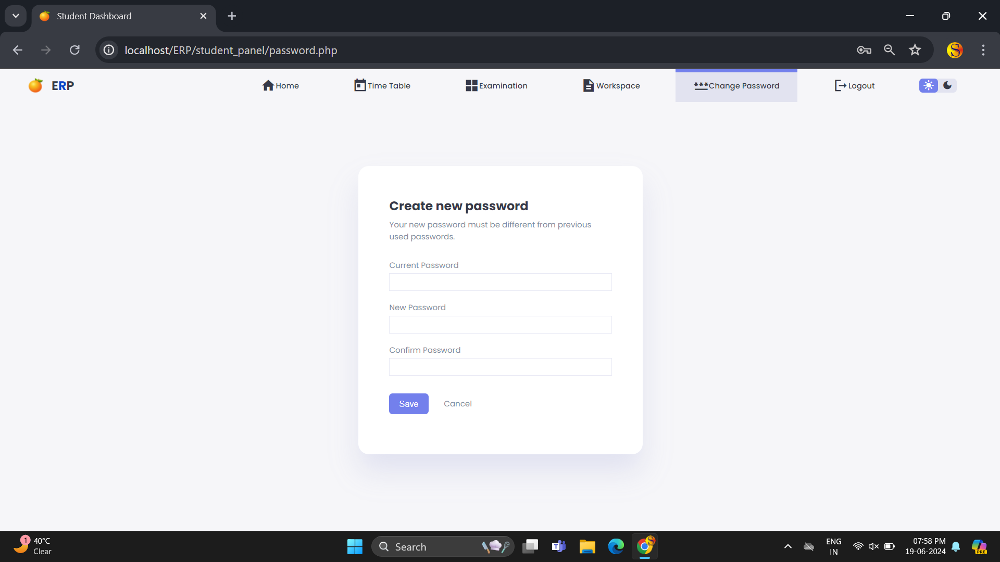
        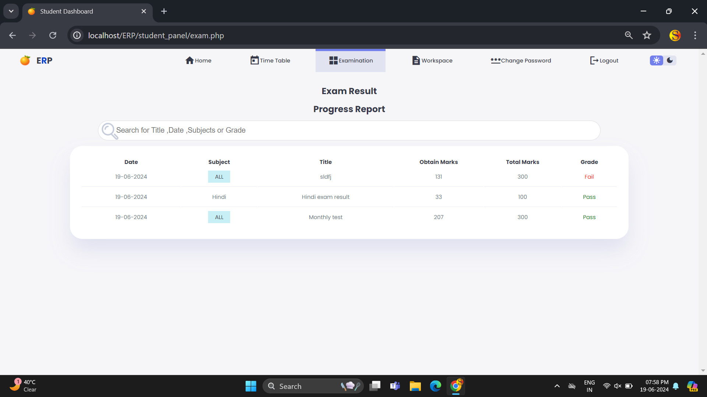
    </div>
    <div style="display: flex; grid-gap: 10px;">
        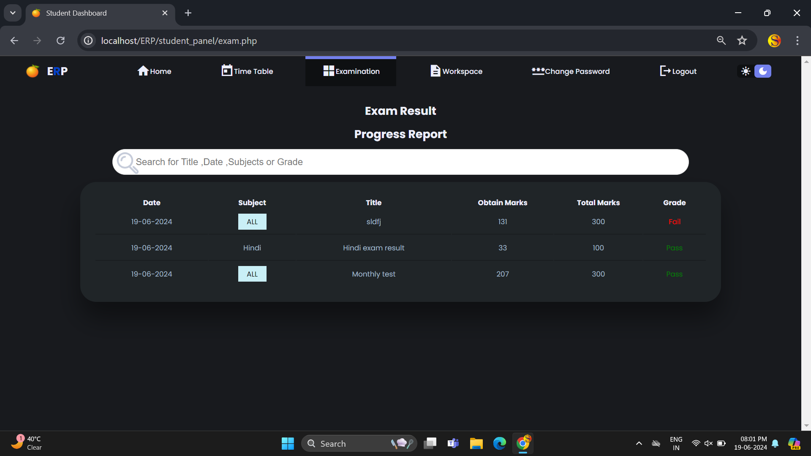
    </div>
    
</div>
<br>


### Owner View
<div style="display: flex;flex-direction: column; grid-gap: 10px;">
    <div style="display: flex; grid-gap: 10px;">
        
        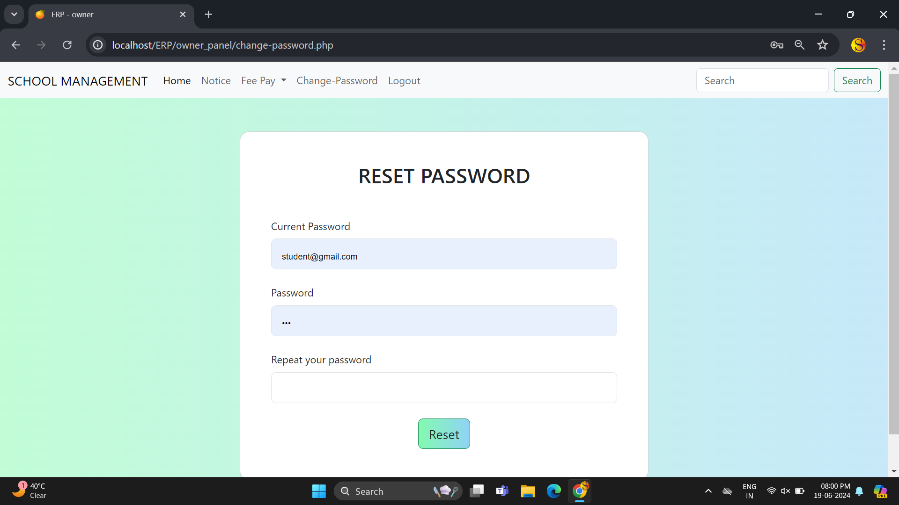
    </div>
    
</div>
<br>

## 🚀 Installation & Setup

### Prerequisites
- **XAMPP** (or equivalent PHP + MySQL environment) or **cPanel hosting** (PHP 8.0+, MySQL 8.0+)
- **PHP 8.0+** (tested on 8.2.12)
- **MySQL 8.0+**
- **mod_rewrite** enabled (Apache)

### Local Setup (XAMPP)
1. Place the **ISNM** folder in `C:\xampp\htdocs\`
2. Start **Apache** and **MySQL** from XAMPP Control Panel
3. Copy `.env.example` to `.env` and `.env.local` — configure database credentials:
   - `.env`: Production credentials (MySQL port **3306**)
   - `.env.local`: Local overrides (root user, port 3306)
4. Run `php sql/deploy_production.php` to create/migrate all tables
5. Run `php sql/seed_production_credentials.php` to seed 30 staff accounts
6. Navigate to **`http://localhost/ISNM`**

### Hosting Deployment
1. Upload all files (exclude `.env.local`) to hosting via FTP/SSH
2. Update `.env` with hosting MySQL credentials (port **3306**, not 3307)
3. Run `php sql/deploy_production.php` via SSH or hosting terminal
4. Run `php sql/seed_production_credentials.php`
5. Verify `.htaccess` blocks `.env*` files (already configured)

## 🔐 Default Login Credentials

The system includes **30 staff accounts** seeded by `sql/seed_production_credentials.php`. Key accounts:

| Role | Email | Password |
|------|-------|----------|
| Director General | director@...ac.ug | ReagaN23# |
| CEO | ceo@...ac.ug | ReagaN23# |
| HR Manager | hr@...ac.ug | ReagaN23# |
| School Bursar | bursar@...ac.ug | ReagaN23# |
| Academic Registrar | registrar@...ac.ug | ReagaN23# |
| School Principal | principal@...ac.ug | ReagaN23# |

All credentials match the official credentials document. Change passwords after initial setup.

## 📁 Project Structure

```
ISNM/
├── index.php                    # Homepage
├── .env / .env.local            # Database credentials (local overrides)
├── .htaccess                    # Security rules (blocks .env, enables rewrite)
├── auth-service.php             # Unified AuthenticationService class
├── auth-handler.php             # POST login handler
├── config/database.php          # DB connections, sanitizeInput(), validators
├── includes/
│   ├── staff_dashboard_access.php  # bootstrapStaffDashboard(), CSRF, session
│   ├── hr_functions.php            # hrGetStaff(), hrGetStats(), hrStatusBadge()
│   └── enterprise_auth.php         # Enterprise auth helpers
├── dashboards/
│   ├── hr-manager.php           # 13-module HR dashboard (Staff, Recruitment, etc.)
│   ├── school-bursar.php        # 11-module Bursar dashboard (Billing, Payroll, etc.)
│   ├── director-general.php     # Director General dashboard
│   └── ... (20+ role dashboards)
├── staff-portal.php             # Staff self-service (payslips, leave, profile)
├── sql/
│   ├── hr_module_complete.sql   # HR schema migration (12 new tables, 15 columns)
│   ├── deploy_production.php    # Deploy script: creates tables, indexes, FKs
│   └── seed_production_credentials.php  # Seeds 30 staff accounts
├── organogram.php               # Organizational chart → role-based login
└── README.md
```

## 🎯 Key Functionalities

### 🌐 Website Features
- **Responsive Design**: Works on all devices
- **Professional Branding**: ISNM colors and logo throughout
- **Interactive Elements**: Smooth animations and transitions
- **Map Integration**: Google Maps for location
- **SEO Optimized**: Meta tags and structured data

### 📱 Student Portal
- **Academic Dashboard**: Overview of academic performance
- **Financial Management**: Fee statements and payment history
- **Document Downloads**: Transcripts, certificates, and academic records
- **Communication**: Messaging with staff and peers
- **Profile Management**: Personal information and photo uploads

### 💼 Management Dashboards
- **Director General**: Complete system oversight
- **School Principal**: Academic and administrative management
- **Director Academics**: Curriculum and faculty management
- **School Bursar**: Comprehensive financial management
- **All Staff**: Role-specific tools and permissions

### 💰 Financial System
- **Student Billing**: Automated fee calculation and invoicing
- **Payment Processing**: Multiple payment methods
- **Budget Management**: Departmental budgets and tracking
- **Financial Reports**: Comprehensive reporting tools
- **Debt Management**: Outstanding fee tracking

## 🔧 Customization

### Branding
- Update logo: Replace `images/school-logo.png`
- Modify colors: Edit `css/isnm-style.css` CSS variables
- Update contact info: Edit footer in shared files

### Database
- Add new fields: Modify `database/isnm_database.sql`
- Update roles: Add to `organizational_positions` table
- Customize programs: Update `programs` table

### Features
- Add new pages: Follow existing page structure
- Extend dashboards: Use dashboard template system
- Integrate payments: Add payment gateway APIs

## 🛡️ Security Features

- **Role-Based Access**: 30 staff roles with `bootstrapStaffDashboard()` permission gating
- **CSRF Protection**: All POST requests validated via `hash_equals()` token check
- **SQL Injection Prevention**: All queries use prepared statements (`bind_param`)
- **Session Management**: 20-min idle / 1-hr absolute timeout, `session_regenerate_id()` on login
- **Password Security**: bcrypt hashing, 10-attempt lockout (5-min), unified error messages (no oracle)
- **Input Validation**: `sanitizeInput()` (trim + strip tags), `validateEmail()`, `validatePhone()`
- **Account Lockout**: Auto-unlock after 5 minutes; inactive accounts blocked at login
- **File Upload Security**: Type checking and size limits
- **Activity Logging**: All logins/logouts recorded in `staff_activity_log` table
- **Error Handling**: Fatal error catcher in `staff_dashboard_access.php` shows friendly error page

## 📞 Support & Contact

**Developer**: Reagan Otema  
**WhatsApp**: +256772514889 (MTN)  
**WhatsApp**: +256730314979 (Airtel)  
**Email**: reagan.otema@example.com

## 📄 License

This project is developed specifically for Iganga School of Nursing and Midwifery. All rights reserved.

## 🤝 Contributing

For improvements and bug reports:
1. Test changes thoroughly
2. Follow existing code structure
3. Document new features
4. Maintain security standards

---

**Note**: This system is designed to be a complete digital solution for ISNM, integrating all aspects of school management into a single, cohesive platform.


